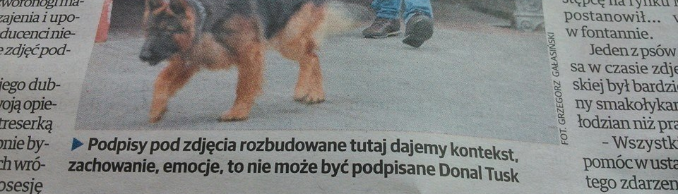

## General
A proof-of-concept app in Python (using Streamlit for UI) for generating short journalistic captions and tags for images. The current version is based on Google Cloud Vision API + OpenAI API. Azure Image Analysis was also extensively tested; an alternative Azure implementation exists on a branch. Sorry, for now the UI and the output captions/tags are **Polish only**! English language support will be implemented soon.  

**Demo currently deployed to Streamlit Community Cloud: [check it out](https://photo-assistant-yjmeumynuaydjxhcu43swk.streamlit.app).** This one will not store your images/data.
<br>
<br>


## Components/files
- **app.py** - the main streamlit app
- **config.py** - reads secrets either from .env or from streamlit secrets
- **content_safety_google.py** - defines ContentSafetyChecker class for obtaining Google SafeSearch evaluation results of an image. Used for content alerts in UI & providing safety context for LLM.
- **faq_system.py** - defines FAQSystem class for storage of FAQs and their embeddings, semantic search and answer generation using LLM
- **image_analyzer.py** - ImageAnalyzer class using Google Cloud Vision. Handles labels, faces, objects, landmarks & OCR, incorporates them in LLM prompt along with user context and safety context.
- **web_entity_detector.py** - defines WebEntityDetector class, which uses Google Cloud Vision Web Detection API to obtain 'best guess label' and the most probable related entity descriptions. They are combined and provided to the user in UI as suggested context. Once approved/edited, they will become 'user context' in the LLM prompt.
- **faq_data.json** - current set of FAQs. When this is modified, FAQSystem will generate new faq_embeddings_cache.pkl
<br>

## How to run
To run the app locally, you need to have an OpenAI API key and a Google Cloud project with Cloud Vision API enabled.  
Install `uv`, clone the repo and:  
```
uv sync
uv run --env-file .env streamlit run app.py
```

The root folder of the repo must contain your `google-credentials.json` and your `.env` file with your secrets:
```
GOOGLE_APPLICATION_CREDENTIALS=google-credentials.json
GOOGLE_PROJECT_ID=
OPENAI_API_KEY=
```
<br>

## Also, feel free to play around online with my earlier test deployments (please note these WILL store your uploads and outputs for review/debugging for some time):  
- [Azure-based test deployment](https://photo-assistant-mtnmekjxqywnved9t7et8p.streamlit.app) leveraging the cool Dense Captions feature of Azure Image Analysis API 4.0  
- [GCP-based test deployment](https://photo-assistant-ggooggllee-ved9t7et8p.streamlit.app) of the current app showcasing the power (and threats) of Web-Detection-obtained context (unlike to the current demo deployment, this one DOES store uploads for future review)  
<br>

  

## Azure vs. Google comparative analysis (or: some fun examples)

### 1) The Hitler case

<picture>
  
</picture>
<br>
<br>
<br>

app | Azure-based (with dense captions) | GCP-based without Web Detection | GCP-based with Web Detection  |
---:|:---:|:---:|:---:|
Context | none | none | 'big hitler' (?) |
LLM output caption | "Żołnierz w mundurze oddaje hołd, przypominając o znaczeniu służby i poświęcenia w obronie kraju." | "Współczesna komunikacja niewerbalna odgrywa istotną rolę w relacjach międzyludzkich, podkreślając znaczenie gestów i wyrazu twarzy w codziennych interakcjach. Znajomość mowy ciała i języka migowego może znacząco ułatwiać porozumiewanie się w zróżnicowanych społecznościach." | "Adolf Hitler pozostaje jedną z najbardziej kontrowersyjnych postaci XX wieku, a jego działania doprowadziły do tragedii II wojny światowej i Holokaustu. Analiza jego dziedzictwa wciąż budzi silne emocje i jest przedmiotem licznych debat historycznych oraz społecznych." |
LLM output tags | "wojsko", "żołnierz", "mundur", "patriotyzm", "honor", "służba", "historia", "obrona" | "komunikacja", "język migowy", "gesty", "mowa ciała", "społeczeństwo", "relacje międzyludzkie", "porozumiewanie się" | "Adolf Hitler", "II wojna światowa", "Holokaust", "historia", "nazizm", "totalitaryzm", "debaty społeczne", "dziedzictwo historyczne" |
Evaluation | :x: | :x: OMG :bangbang: | :white_check_mark:|

Both Azure Image Analysis and Google Cloud Vision failed (the latter quite miserably) by providing general or misleading captions, labels and objects to LLM. Interestingly, swastika was not detected nor labeled (more precisely, in GCP it was detected by OCR as '5'). Moderation components raised no alerts as well. GCP Web Detection saved the day - equipped with the right 'user context' (auto-generated and accepted by the user), LLM gave it priority over such Cloud Vision labels as "sign language" and produced correct tags itself.

<br>
<br>


### 2) Camouflage

<picture>
  
</picture>
<br>
<br>
<br>

app | Azure-based (with dense captions) | GCP-based without Web Detection | GCP-based with Web Detection  |
---:|:---:|:---:|:---:|
Context | none | none | barwy ochronne, Krzysztof Zanussi, Camouflage |
LLM output caption | "Spotkanie na leśnej ścieżce przypomina o znaczeniu codziennych relacji i chwil wytchnienia poza miejskim zgiełkiem." | "Kult ciała i sprawności fizycznej odgrywa istotną rolę we współczesnej kulturze, podkreślając znaczenie zdrowego stylu życia oraz wyzwań związanych z presją społeczną dotyczącą wyglądu." | "Motyw barw ochronnych w twórczości Krzysztofa Zanussiego nawiązuje do zagadnień tożsamości, przystosowania i ukrywania prawdziwego oblicza w obliczu społecznych oczekiwań. Film 'Barwy ochronne' pozostaje jednym z ważniejszych głosów polskiego kina w refleksji nad mechanizmami konformizmu i moralnych wyborów."
LLM output tags | "ludzie", "natura", "relacje", "spacer", "las", "odpoczynek", "codzienność" | "kultura fizyczna", "zdrowy styl życia", "presja społeczna", "ciało", "sport", "wizerunek", "społeczeństwo" | "Krzysztof Zanussi", "Barwy ochronne", "polskie kino", "tożsamość", "konformizm", "film", "moralność", "Camouflage"
Evaluation | :x: | :x: | :white_check_mark:|

Captions obtained without the web-search based context were beside the point (Azure) or bordering on ridiculous (GCP). Again, when provided with 'user context' the LLM is prompted to treat it with high priority, overridng the labels provided from vision API.


<br>
<br>

### 3) Too Black

<picture>
  
</picture>
<br>
<br>
<br>

app | Azure-based (with dense captions) | GCP-based without Web Detection | GCP-based with Web Detection  |
---:|:---:|:---:|:---:|
Context | none | none | metallica albums |
Dense Captions | "a logo on a black background", "a snake on a black background", "a black and white image of a metallica logo", "a logo of a metallica" | none | none
OCR | none | 'ETALLIC' | 'ETALLIC' |
LLM output caption | Logo legendarnego zespołu Metallica, jednego z najważniejszych symboli światowego heavy metalu, rozpoznawalne przez kolejne pokolenia fanów muzyki rockowej. | Motywy nocy i ciemności od dawna inspirują twórców wizualnych, stając się tłem dla refleksji nad nieznanym i granicami percepcji. | Twórczość zespołu Metallica od lat inspiruje kolejne pokolenia fanów muzyki metalowej, a ich albumy stały się ikonami światowej sceny rockowej.
LLM output tags | "Metallica", "muzyka", "rock", "heavy metal", "logo", "kultura popularna", "symbol", "zespół muzyczny" | "noc", "ciemność", "grafika", "projektowanie graficzne", "sztuka współczesna", "abstrakcja", "inspiracja", "kreatywność" | "Metallica", "muzyka", "albumy", "rock", "metal", "kultura", "ikony muzyki", "historia muzyki"
Evaluation |  ➕ / ➖ | ⁉️ | ➕ / ➖ |


While none of the results are fully satisfying (the album hasn't been identified, actually), there are some interesting things happening here. This example shows the power of Dense Captions - instead of listing one-word labels, dense captions provide a list of more descriptive captions for image's sub-regions. Here they included "a logo of a metallica" (sic!), which enabled the LLM to come up with an _almost_ acceptable caption and quite good tags. GCP implementation did very bad without web detection (the OCR-detected 'etallic' didn't help). Thanks to web detection, LLM produced vaguely relevant (if grammatically incorrect) caption and quite satisfying tags.


<br>
<br>

**All in all, based on the above axamples and my other trials, if somebody told me not to use Web Detection, I'd prefer to switch back to Azure with Dense Captions!**

<br>
<br>
### To be continued?




